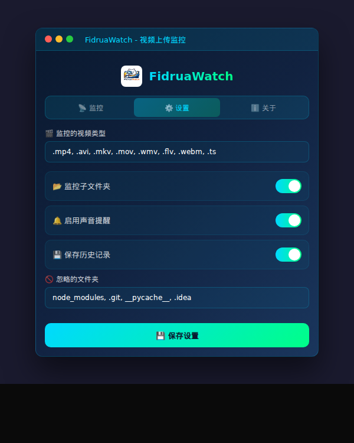

# FidruaWatch

<p align="center">
  
</p>

<p align="center">
  <strong>Professional Batch Video Upload Monitor</strong>
</p>

<p align="center">
  <a href="README_CN.md">中文</a> | English
</p>

<p align="center">
  
  
  
</p>

---

## ✨ Features

- 🌐 **Cross-platform** - Windows / macOS / Linux
- 📁 **Smart Batching** - Files in same directory grouped as one batch
- 🔔 **Start Notification** - Alert when upload detected
- ⏱️ **Completion Detection** - Auto-complete after 30s of no activity
- ✅ **Batch Acknowledgment** - Confirm processed upload batches
- 🎬 **Video Focused** - Monitor common video formats by default
- 🎨 **Tech UI** - Cyan-green high-tech theme

---

## 📸 Screenshots

<table>
  <tr>
    <td align="center">
      
      <br><strong>Monitor</strong>
    </td>
    <td align="center">
      
      <br><strong>Settings</strong>
    </td>
  </tr>
</table>

---

## 📥 Download

Go to [Releases](https://github.com/donma033x/FidruaWatch/releases) to download the latest version:

| Platform | File |
|----------|------|
| 🪟 Windows | `.msi` or `.exe` |
| 🍎 macOS (Intel) | `_x64.dmg` |
| 🍎 macOS (Apple Silicon) | `_aarch64.dmg` |
| 🐧 Linux | `.AppImage` or `.deb` |

---

## 🚀 Usage

1. **Select Folder** - Choose the video upload folder to monitor
2. **Start Monitoring** - Click "Start Monitor" button
3. **Upload Started** - Get notified when new video files detected
4. **Upload Completed** - Get notified after 30s of no new file activity
5. **Acknowledge** - Click to confirm processed batches

---

## 🎬 Supported Video Formats

Default monitored formats (customizable in settings):

```
.mp4  .avi  .mkv  .mov  .wmv  .flv  .webm  .m4v  .mpeg  .mpg  .3gp  .ts
```

---

## 🛠️ Development

### Requirements

- [Node.js](https://nodejs.org/) >= 18
- [Rust](https://www.rust-lang.org/) >= 1.70
- [Tauri CLI](https://tauri.app/)

### Local Development

```bash
# Install dependencies
npm install

# Development mode
npm run tauri dev

# Build
npm run tauri build
```

### Tech Stack

- **Frontend**: HTML / CSS / JavaScript
- **Backend**: Rust + Tauri 2.0
- **File Watcher**: notify-rs

---

## 📄 License

MIT License

---

<p align="center">
  Made with 💙 by Fidrua
</p>
